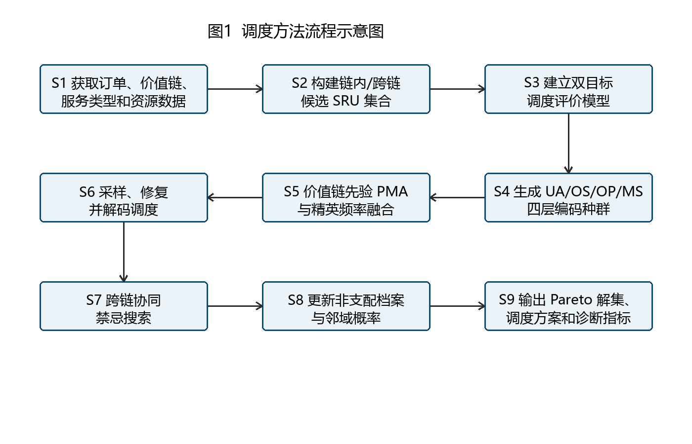
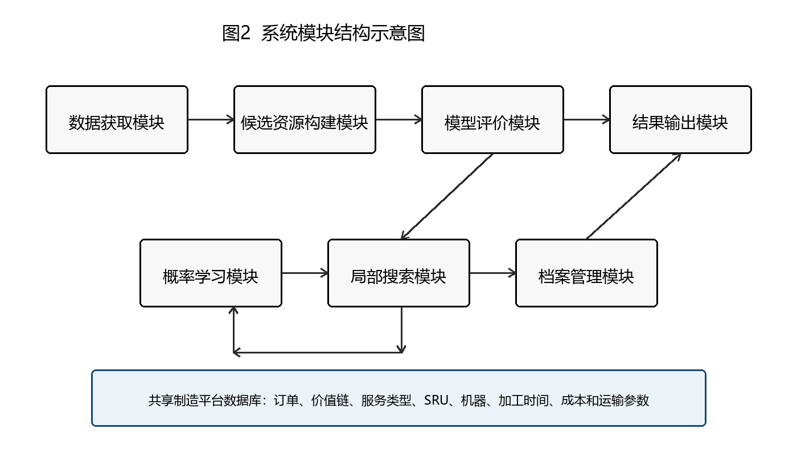

---
title: 一种面向多服务价值链协同的共享制造分布式柔性作业车间调度方法及系统
source_docx: MVC_SM_DFJSP_patent_value_chain_2026-06-16.docx
---

# 说明书摘要

本发明涉及共享制造与智能调度技术领域，具体涉及一种面向多服务价值链协同的共享制造分布式柔性作业车间调度方法及系统。该方法包括以下步骤：S1、获取共享制造平台中的订单、价值链、服务类型、服务资源单元、机器、加工时间、加工成本、运输时间、运输成本和跨链固定协调成本数据；S2、根据订单所属价值链和订单服务类型构建链内候选服务资源单元集合与跨链候选服务资源单元集合；S3、设置不允许跨链和允许跨链两类调度模式；S4、建立以总成本和最大完工时间最小化为目标的双目标调度模型；S5、采用订单资源分配、工序排序、服务资源单元内部工序队列和机器选择四层编码表示调度方案；S6、构建融合精英解频率与价值链先验的概率模型；S7、采样生成新调度个体并执行可行性修复；S8、解码计算调度目标和跨链诊断指标；S9、执行链内替换、跨链替换、跨链回流、关键订单迁移、高成本跨链回流以及机器与工序重排的禁忌搜索；S10、更新非支配解档案并输出 Pareto 调度方案。本发明显式区分订单价值链归属与制造服务类型需求，能够在同一共享制造调度框架中比较链内加工与跨链协同加工，提升多价值链共享制造平台在成本、工期和资源协同方面的优化能力。

摘要附图

摘要附图

# 权利要求书

1. 一种面向多服务价值链协同的共享制造分布式柔性作业车间调度方法，其特征在于，包括以下步骤：S1、获取共享制造平台的订单集合、价值链集合、服务类型集合、服务资源单元集合、机器集合、订单工序集合、工序加工时间、单位加工成本、运输时间、运输成本、服务资源单元所属价值链、服务资源单元可提供服务类型以及跨链固定协调成本数据；S2、依据订单所属价值链和订单服务类型，为每个订单构建链内候选服务资源单元集合和跨链候选服务资源单元集合；S3、根据跨链模式确定订单可选服务资源单元范围；S4、建立以总成本最小化和最大完工时间最小化为目标的双目标调度评价模型；S5、生成包含订单资源分配 UA、工序排序 OS、服务资源单元内部工序队列 OP 和机器选择 MS 的四层编码个体；S6、根据非支配解档案和精英解构建价值链感知概率模型；S7、依据所述价值链感知概率模型采样生成新个体并进行可行性修复；S8、对新个体进行解码，计算总成本、最大完工时间以及跨链诊断指标；S9、对个体执行跨链协同禁忌搜索；S10、依据 Pareto 支配关系更新非支配解档案并输出调度方案。

2. 根据权利要求1所述的调度方法，其特征在于，所述链内候选服务资源单元集合由服务类型与订单需求匹配且所属价值链与订单所属价值链相同的服务资源单元构成；所述跨链候选服务资源单元集合由服务类型与订单需求匹配且所属价值链与订单所属价值链不同的服务资源单元构成。

3. 根据权利要求1所述的调度方法，其特征在于，当跨链模式为不允许跨链时，订单只能从链内候选服务资源单元集合中选择服务资源单元；当跨链模式为允许跨链时，订单能够从链内候选服务资源单元集合与跨链候选服务资源单元集合的并集中选择服务资源单元。

4. 根据权利要求1所述的调度方法，其特征在于，所述总成本包括加工成本、运输成本和跨链固定协调成本，其中加工成本由各订单工序在所选机器上的加工时间与单位加工成本确定，运输成本由订单选择的服务资源单元与需求节点之间的运输参数确定，跨链固定协调成本由订单跨价值链调用服务资源单元时产生。

5. 根据权利要求1所述的调度方法，其特征在于，所述最大完工时间由各订单最后一道工序完成时间与该订单所选服务资源单元对应运输时间共同确定。

6. 根据权利要求1所述的调度方法，其特征在于，所述四层编码中，UA 层用于表示每个订单选择的服务资源单元，OS 层用于表示订单工序加工顺序，OP 层由 UA 层和 OS 层推导得到并用于表示每个服务资源单元内部的工序队列，MS 层用于表示服务资源单元内部每道工序选择的机器。

7. 根据权利要求1所述的调度方法，其特征在于，所述价值链感知概率模型包括订单资源分配概率矩阵 PMA、工序排序概率矩阵 PMS 和机器选择概率矩阵 PMM，其中 PMA 由精英解中的订单-服务资源单元选择频率与价值链感知先验概率融合更新。

8. 根据权利要求7所述的调度方法，其特征在于，所述价值链感知先验概率根据候选服务资源单元对应的加工成本、运输成本、跨链固定协调成本、预计完成时间以及相对于链内候选服务资源单元的跨链时间收益计算得到。

9. 根据权利要求1所述的调度方法，其特征在于，所述可行性修复包括服务类型匹配修复、跨链模式约束修复、机器可加工性修复和服务资源单元内部工序队列重建。

10. 根据权利要求1所述的调度方法，其特征在于，所述跨链协同禁忌搜索包括链内服务资源单元替换、跨链服务资源单元替换、跨链回流、关键订单迁移、高成本跨链回流以及机器与工序重排中的一种或多种邻域操作。

11. 根据权利要求10所述的调度方法，其特征在于，所述跨链协同禁忌搜索记录各邻域操作的接受次数、进入非支配解档案次数和目标改进幅度，并根据记录结果自适应更新各邻域操作的选择概率。

12. 根据权利要求1所述的调度方法，其特征在于，所述非支配解档案用于保存搜索过程中获得的 Pareto 非支配解，并作为概率模型更新的学习样本和禁忌搜索的局部搜索种子；当非支配解档案超过预设容量时，优先保留目标空间中分布较分散的解。

13. 根据权利要求1所述的调度方法，其特征在于，所述跨链诊断指标包括跨链订单比例、价值链间跨链调用流、价值链流入订单数、价值链流出订单数、服务资源单元负载标准差以及最大服务资源单元负载中的一种或多种。

14. 一种应用权利要求1至13任一项所述调度方法的共享制造分布式柔性作业车间调度系统，其特征在于，包括：数据获取模块、候选资源构建模块、模型评价模块、编码解码模块、概率学习模块、局部搜索模块、档案管理模块和结果输出模块。

15. 一种电子设备，其特征在于，包括处理器和存储器，所述存储器中存储有计算机程序，所述计算机程序被所述处理器执行时实现权利要求1至13任一项所述的调度方法。

16. 一种计算机可读存储介质，其特征在于，所述计算机可读存储介质中存储有计算机程序，所述计算机程序被处理器执行时实现权利要求1至13任一项所述的调度方法。

# 说明书

一种面向多服务价值链协同的共享制造分布式柔性作业车间调度方法及系统

## 技术领域

本发明涉及共享制造、分布式柔性作业车间调度、多目标优化和智能调度算法技术领域，具体涉及一种面向多服务价值链协同的共享制造分布式柔性作业车间调度方法及系统。

## 背景技术

共享制造平台通过网络化方式聚合分散制造资源，使订单能够在不同服务资源单元中获得加工服务。分布式柔性作业车间调度问题需要同时决定订单分配、工序排序和机器选择，既要满足工序先后关系、机器能力约束和资源可用性约束，又要兼顾成本、交期和资源利用效率。

现有共享制造分布式柔性作业车间调度研究通常以供需类型匹配为基础，即订单具有某类制造服务需求，服务资源单元提供相应服务类型，调度系统在类型匹配的服务资源单元中选择加工资源。该类方法能够解决制造服务需求与资源能力的一致性问题，但通常没有显式刻画多个服务价值链共存时的资源边界和协同方式。

在第三方共享制造平台中，不同核心企业、不同客户群或不同业务网络可形成多条服务价值链。每条价值链内部拥有一定服务资源，同时部分资源可以向其他价值链开放共享。若仅按服务类型匹配进行调度，系统难以区分订单使用本价值链资源还是跨价值链资源，也难以量化跨链调用带来的协调成本、运输成本、交付时间变化和负载转移效果。

此外，传统估计分布算法与禁忌搜索结合的 EDA-TS 方法主要面向一般资源分配、工序排序和机器选择，其概率学习通常根据精英解频率更新，缺少对价值链归属、链内候选资源和跨链候选资源的结构化建模。因此，有必要提供一种能够显式表达多服务价值链、服务类型匹配、链内协同、跨链协同和多目标优化的调度方法及系统。

## 发明内容

本发明所要解决的技术问题在于提供一种面向多服务价值链协同的共享制造分布式柔性作业车间调度方法及系统，以解决现有方法不能同时表达价值链归属、供需类型匹配和跨链资源调用，以及传统 EDA-TS 算法缺少价值链感知概率学习和跨链协同邻域的问题。

S1、数据获取：获取共享制造平台的订单集合 J、价值链集合 V、服务类型集合 T、服务资源单元集合 U、机器集合 M、订单工序集合 O、工序加工时间、单位加工成本、运输时间、运输成本、服务资源单元所属价值链、服务资源单元可提供服务类型以及跨链固定协调成本。

S2、候选资源构建：对每个订单，根据订单所属价值链和服务类型构建候选资源集合；属于同一价值链且服务类型匹配的服务资源单元构成链内候选集合，属于其他价值链且服务类型匹配的服务资源单元构成跨链候选集合。

S3、跨链模式设置：设置不允许跨链模式和允许跨链模式；不允许跨链模式下，订单只能选择链内候选服务资源单元；允许跨链模式下，订单能够选择链内候选服务资源单元或跨链候选服务资源单元。

S4、调度模型建立：建立双目标评价模型，第一目标为总成本最小化，第二目标为最大完工时间最小化；总成本包括加工成本、运输成本和跨链固定协调成本。

S5、个体编码：构造 UA、OS、OP 和 MS 四层编码，其中 UA 表示订单到服务资源单元的分配，OS 表示工序排序，OP 表示每个服务资源单元内部的工序队列，MS 表示每道工序在已选服务资源单元内的机器选择。

S6、概率学习：构建订单资源分配概率矩阵 PMA、工序排序概率矩阵 PMS 和机器选择概率矩阵 PMM。PMA 融合精英解频率和价值链感知先验概率，价值链感知先验概率由候选服务资源单元对应的成本、时间、跨链固定协调成本和跨链时间收益确定。

S7、采样与修复：依据概率模型采样生成新个体。若新个体违反服务类型匹配约束、跨链模式约束或机器可加工约束，则在对应候选集合中进行修复，并重新生成服务资源单元内部工序队列。

S8、解码评价：对可行个体进行解码，维护订单就绪时间和机器就绪时间，计算每道工序的开始时间和完成时间，并得到总成本、最大完工时间、服务资源单元负载、跨链比例和价值链流向。

S9、跨链协同禁忌搜索：对个体执行链内服务资源单元替换、跨链服务资源单元替换、跨链回流、关键订单迁移、高成本跨链回流以及机器与工序重排等邻域搜索，并利用禁忌表避免搜索循环。

S10、档案更新与结果输出：根据 Pareto 支配关系更新非支配解档案，将非支配解档案作为后续概率学习样本和局部搜索种子，最终输出 Pareto 调度方案、成本-工期折中结果和跨链诊断指标。

相比于现有技术，本发明能够在共享制造调度中引入价值链归属层，使订单选择资源时不仅考虑服务类型匹配，还考虑链内资源和跨链资源的差异；能够通过 cross-off 与 cross-on 两种模式比较不允许跨链和允许跨链时的成本、工期和资源流动变化；能够通过价值链感知概率模型和跨链协同邻域提高多价值链共享制造场景中的 Pareto 搜索质量，并在允许跨链时改善最大完工时间和服务资源单元负载均衡。

## 附图说明

图1为本发明实施例中一种面向多服务价值链协同的共享制造分布式柔性作业车间调度方法的流程示意图。

图2为本发明实施例中一种面向多服务价值链协同的共享制造分布式柔性作业车间调度系统的模块结构示意图。

## 具体实施方式

下面结合附图和实施例对本发明作进一步说明。以下实施例用于说明本发明的技术方案，并非用于限定本发明的保护范围。为避免不同文字处理软件对公式对象的兼容性差异，本实施例中的数学关系以普通文本公式表示。

## 实施例一：调度方法

如图1所示，共享制造平台接收多个订单。每个订单具有所属价值链和服务类型，每个服务资源单元具有所属价值链、可提供服务类型以及内部机器集合。平台首先读取订单、服务资源单元、机器、加工时间、加工成本、运输时间、运输成本和跨链固定协调成本等数据。

对于订单 j，平台根据服务类型匹配规则筛选候选服务资源单元。若候选服务资源单元 u 的可提供服务类型包含订单 j 的服务类型，且 u 的所属价值链与订单 j 的所属价值链相同，则 u 被加入链内候选集合；若候选服务资源单元 u 的可提供服务类型包含订单 j 的服务类型，且 u 的所属价值链与订单 j 的所属价值链不同，则 u 被加入跨链候选集合。

候选集合可表示为：A_j = A_j^in ∪ A_j^cross；A_j^in = {u ∈ U | type_j ∈ types_u, vc_j = vc_u}；A_j^cross = {u ∈ U | type_j ∈ types_u, vc_j ≠ vc_u}。当不允许跨链时，订单 j 的可选集合为 A_j^in；当允许跨链时，订单 j 的可选集合为 A_j^in ∪ A_j^cross。

调度目标包括总成本和最大完工时间，表示为：min F1 = total_cost；min F2 = makespan。总成本表示为 F1 = PC + TC + CFC，其中 PC 为加工成本，TC 为运输成本，CFC 为跨链固定协调成本。最大完工时间表示为 F2 = max_j(C_j + tt_j,u)，其中 C_j 为订单 j 最后一道工序的完成时间，tt_j,u 为订单 j 选择服务资源单元 u 后的运输时间。

调度个体采用四层编码。UA 层记录每个订单分配到哪个服务资源单元，是表达链内协同和跨链协同的关键层；OS 层记录订单工序排序；OP 层由 UA 层和 OS 层推导得到，用于描述各服务资源单元内部的工序队列；MS 层记录每道工序在所选服务资源单元内部选择的机器。

在概率学习阶段，系统分别维护 PMA、PMS 和 PMM。PMA 的先验评分由加工成本、运输成本、跨链固定协调成本、预计完成时间和跨链时间收益加权得到。系统将该先验概率与精英解中订单选择服务资源单元的频率融合，形成新的目标概率，再按学习率更新订单资源分配概率矩阵。

在局部搜索阶段，系统执行跨链协同禁忌搜索。链内服务资源单元替换用于在同一价值链、同一服务类型的服务资源单元之间移动订单；跨链服务资源单元替换用于将订单迁移到其他价值链的同服务类型服务资源单元；跨链回流用于将已跨链订单迁回本价值链资源；关键订单迁移用于将影响最大完工时间的订单迁移到预计完成时间更短的候选资源；高成本跨链回流用于将跨链成本较高的订单迁回链内或低成本候选资源；机器与工序重排用于改善服务资源单元内部的柔性作业车间排程。

系统使用非支配解档案保存 Pareto 优质调度方案。非支配解档案中的解既用于最终输出，也用于下一轮概率学习和局部搜索种子选择。当档案规模超过设定容量时，系统优先保留目标空间中分布较分散的解，以维持成本与工期折中的多样性。

## 实施例二：调度系统

如图2所示，一种应用上述调度方法的共享制造分布式柔性作业车间调度系统包括数据获取模块、候选资源构建模块、模型评价模块、编码解码模块、概率学习模块、局部搜索模块、档案管理模块和结果输出模块。

数据获取模块用于获取订单、价值链、服务类型、服务资源单元、机器、加工时间、加工成本、运输时间、运输成本和跨链固定协调成本数据。候选资源构建模块用于根据订单服务类型和价值链归属生成链内候选集合和跨链候选集合。模型评价模块用于计算总成本和最大完工时间。编码解码模块用于生成和解码 UA、OS、OP、MS 四层编码。概率学习模块用于更新 PMA、PMS、PMM。局部搜索模块用于执行跨链协同禁忌搜索。档案管理模块用于维护 Pareto 非支配解档案。结果输出模块用于输出调度方案、目标值、跨链比例、价值链流入流出和服务资源单元负载等指标。

## 实施例三：实验数据与参数

在一个可选实施例中，采用由 MK/FJSP benchmark 扩展得到的 MVC-MK01 至 MVC-MK15 实例作为测试数据。该数据集设置两条价值链、两类服务类型和四个服务资源单元。价值链 VC1 和 VC2 作为订单级业务归属标签；服务类型 T1 和 T2 作为订单制造服务需求标签；服务资源单元设置为 U1=VC1-T1、U2=VC1-T2、U3=VC2-T1、U4=VC2-T2。每个订单具有一个服务类型匹配的链内服务资源单元和一个服务类型匹配的跨链服务资源单元。候选服务资源单元上的加工时间与原 MK 实例加工时间一致，单位加工成本在候选服务资源单元之间保持一致。链内运输时间设置为 2 + job_id mod 2，链内运输单位成本为 1.8；跨链运输时间设置为 7 + job_id mod 3，跨链运输单位成本为 4.8；跨链固定协调成本为 200.0；正式总成本为加工成本、运输成本和跨链固定协调成本之和。

算法参数可设置如下：种群规模 popsize 为 50，最大迭代次数 max_iter 为 50，随机种子为 20260428 和 20260429，单次运行时间上限为 600 秒，目标维度为 2。每种算法或跨链模式在 MVC-MK01 至 MVC-MK15 上形成 30 次运行记录。对比算法包括 NSGA-II、MOEA/D、普通 EDA-TS 和本发明的 MVC-EDA-TS；NSGA-II、MOEA/D、普通 EDA-TS 与 MVC-EDA-TS 在不允许跨链模式下比较，MVC-EDA-TS 进一步在不允许跨链模式和允许跨链模式下比较。

| 项目 | 示例设置 |
| --- | --- |
| 实例数据 | MVC-MK01 至 MVC-MK15，由 MK/FJSP benchmark 扩展得到 |
| 价值链数量 | 2 条：VC1、VC2 |
| 服务类型数量 | 2 类：T1、T2 |
| 服务资源单元数量 | 4 个：U1=VC1-T1，U2=VC1-T2，U3=VC2-T1，U4=VC2-T2 |
| 目标函数 | 总成本 total_cost、最大完工时间 makespan |
| 正式成本口径 | 加工成本 + 运输成本 + 跨链固定协调成本 |
| 算法参数 | popsize=50，max_iter=50，seeds=20260428、20260429，time_limit=600s |
| 对比算法 | NSGA-II、MOEA/D、Plain EDA-TS、MVC-EDA-TS；其中 MVC-EDA-TS 比较 cross-off 与 cross-on |

在上述实验口径下，MVC-EDA-TS-off 在 MVC-MK01 至 MVC-MK15 上的平均归一化 HV 为 0.6161，平均 IGD 为 14281.6，平均最低总成本为 15383.7，平均最短最大完工时间为 208.7，均优于 NSGA-II-off、MOEA/D-off 和 Plain EDA-TS-off。Wilcoxon signed-rank tests 显示，MVC-EDA-TS-off 相对三类 cross-off 基线在 HV、IGD、最低总成本和最短最大完工时间上均达到显著优势，调整后 p 值不高于 0.0288；Friedman ranking 中，MVC-EDA-TS 在 HV、IGD、最低总成本和最短最大完工时间四项指标上的平均排名均为第一。

| 比较项 | MVC-EDA-TS-off | NSGA-II-off | MOEA/D-off | Plain EDA-TS-off | 结论 |
| --- | --- | --- | --- | --- | --- |
| 平均归一化 HV | 0.6161 | 0.5702 | 0.5653 | 0.5628 | MVC-EDA-TS 更高 |
| 平均 IGD | 14281.6 | 16263.9 | 16181.7 | 15551.7 | MVC-EDA-TS 更低 |
| 平均最低总成本 | 15383.7 | 17369.4 | 17286.4 | 16655.2 | MVC-EDA-TS 更低 |
| 平均最短最大完工时间 | 208.7 | 235.6 | 250.1 | 272.4 | MVC-EDA-TS 更低 |
| 平均服务资源单元负载标准差 | 337.9 | 362.4 | 364.0 | 351.1 | MVC-EDA-TS 更低 |
| 统计检验 | HV、IGD、成本、工期显著 | p<=0.0288 | p<=0.0073 | p<=0.0073 | Friedman 平均排名第一 |

进一步地，将 MVC-EDA-TS-on 与 MVC-EDA-TS-off 比较可见，允许跨链后的平均归一化 HV 从 0.6161 提高至 0.6406，平均最短最大完工时间从 208.7 降低至 165.1，服务资源单元负载标准差从 337.9 降低至 216.4，平均跨链订单比例为 0.1094。相应地，跨链固定协调成本由 0 增加至 220.2，说明跨链协同并非无成本调用外部资源，而是在保持最低总成本边界基本不变的同时，以有限协调成本换取更短交付时间、更宽 Pareto 覆盖和更均衡的资源负载。

| 比较项 | MVC-EDA-TS-off | MVC-EDA-TS-on | 变化 | 技术含义 | 备注 |
| --- | --- | --- | --- | --- | --- |
| 平均归一化 HV | 0.6161 | 0.6406 | +4.0% | 允许跨链扩大 Pareto 覆盖 | Wilcoxon p=0.0018 |
| 平均 IGD | 14281.6 | 14281.8 | 基本持平 | 跨链机制未明显损害收敛距离 | 差异不显著 |
| 平均最低总成本 | 15383.7 | 15383.7 | 基本持平 | 最低成本边界保持稳定 | 统计结果为 tie |
| 平均最短最大完工时间 | 208.7 | 165.1 | 降低 20.9% | 外部同类型资源缩短交付时间 | Wilcoxon p=0.0022 |
| 平均跨链订单比例 | 0.0000 | 0.1094 | +0.1094 | 仅部分订单发生跨链调用 | 避免无约束跨链 |
| 平均服务资源单元负载标准差 | 337.9 | 216.4 | 降低 36.0% | 跨链协同改善资源负载均衡 | 来自跨链诊断指标 |
| 平均跨链固定协调成本 | 0.0 | 220.2 | +220.2 | 以有限协调成本换取工期与负载收益 | 成本拆解可解释 |
| 平均运行时间 | 83.8s | 426.3s | 增加 | 允许跨链后搜索空间扩大 | 部分运行触发 600s 限时 |

在一个解释性小案例中，链内优先方案的总成本为 120.0、最大完工时间为 95.0；跨链优先方案的总成本为 168.0、最大完工时间为 68.0；折中方案的总成本为 145.0、最大完工时间为 78.0。该结果表明，本发明能够在同一共享制造调度框架中比较链内调度和跨链协同调度，输出成本-工期折中解，分析跨链协同对成本、工期、价值链流向和服务资源单元负载的影响，并能够通过价值链感知概率模型和跨链协同禁忌搜索提高多价值链共享制造场景中的调度优化能力。

以上所述仅为本发明的实施例。对于本领域普通技术人员而言，在不脱离本发明构思的前提下，还可以对价值链数量、服务类型数量、服务资源单元数量、跨链成本函数、邻域操作种类、概率学习参数、目标函数数量和调度约束作出若干变形或替换，这些变形或替换均应落入本发明的保护范围。

# 说明书附图

## 图1

图1  调度方法流程示意图

## 图2

图2  调度系统模块结构示意图
